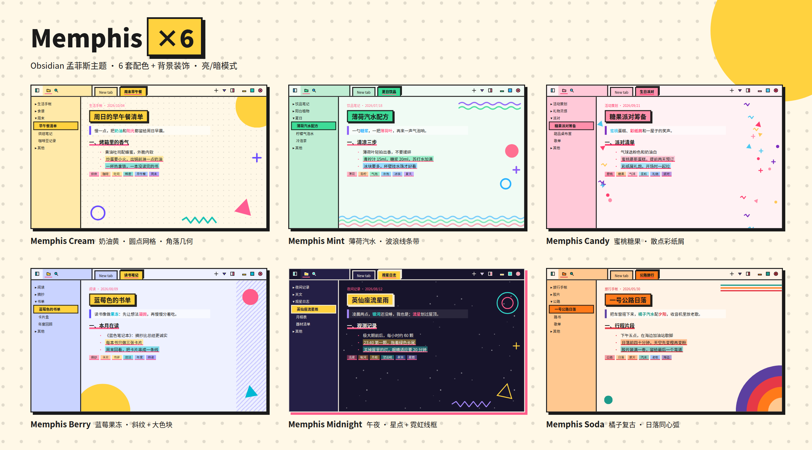
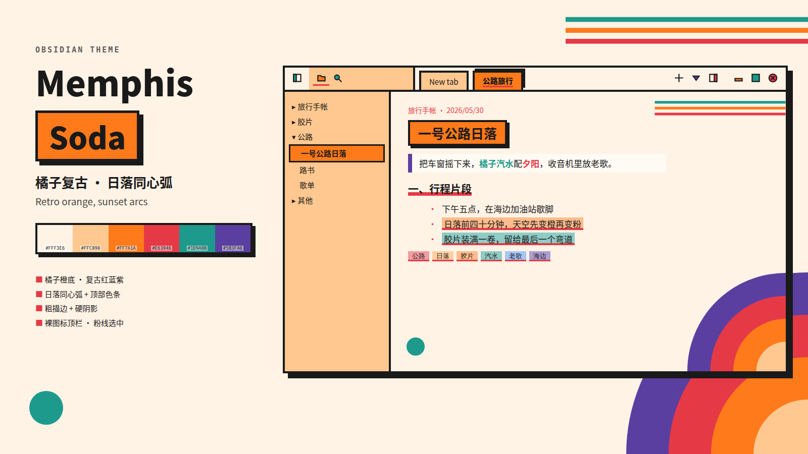
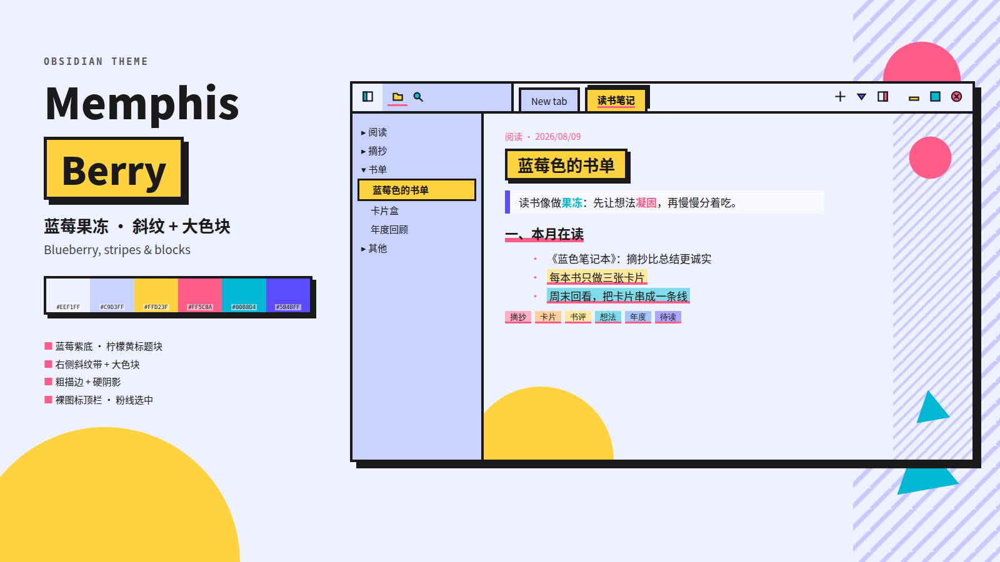
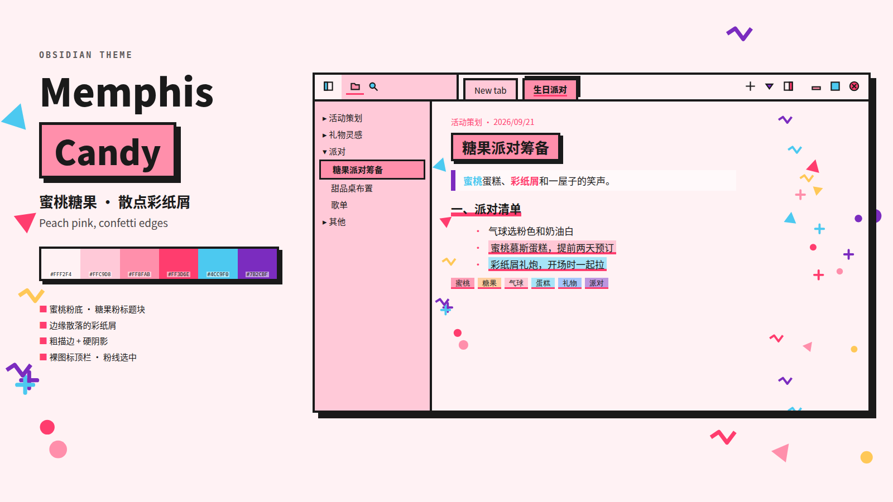
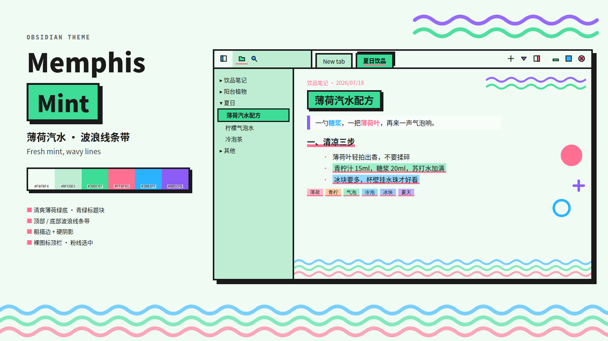
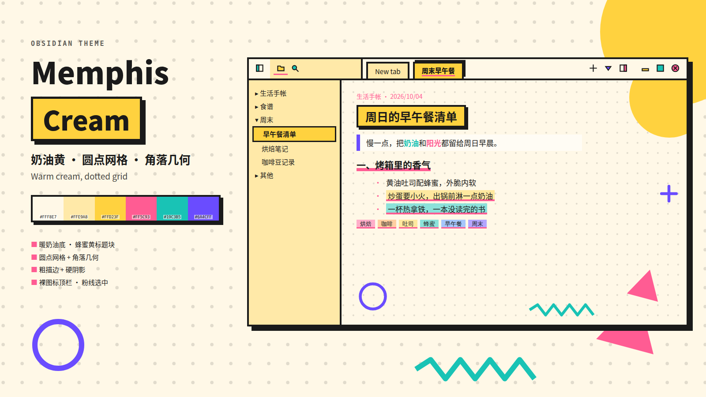
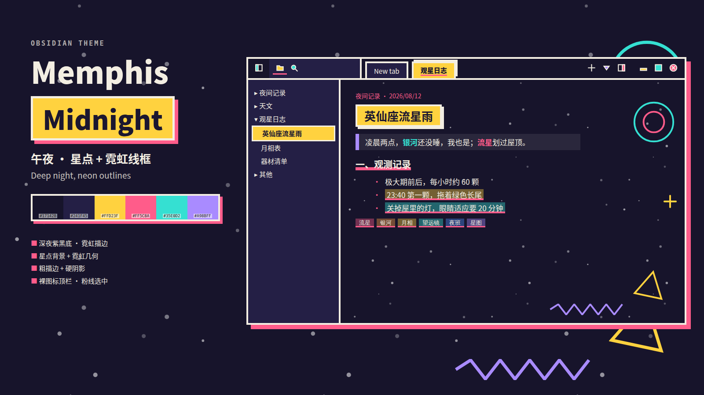

# Memphis Suite

> An Obsidian theme merging 6 Memphis variants into one — switch color schemes, icons, code highlighting, and decorative patterns on the fly.

将 6 个 Memphis 变体主题合并为一个，通过 `@settings` 配色方案切换：配色、图标、代码高亮、装饰图案四维同步切换。

## 配色方案

| 方案 | 亮色配色 | 装饰图案 |
|------|---------|---------|
| 糖果(默认) | `#FF5C93` `#19C3B5` `#FFD23F` `#6A4CFF` | 圆圈·三角·波浪线·点状底纹 |
| 橘子复古 | `#E63946` `#1D9A8B` `#FF7A1A` `#5B3FA0` | 同心圆·条纹·小圆 |
| 蓝莓果冻 | `#FF5C8A` `#00B8D4` `#FFD23F` `#5B4BFF` | 波浪线·圆环·十字 |
| 蜜桃糖果 | `#FF3D6E` `#4CC9F0` `#FF8FAB` `#7B2CBF` | 圆点·胶带·波浪 |
| 薄荷汽水 | `#FF6F91` `#2BB3FF` `#3DDC97` `#8B5CF6` | 双波浪·实心圆·圆环 |
| 奶油黄 | 同糖果配色 | 圆圈·三角·波浪线·十字·圆环 |
| 午夜 | `#FF5C8A` `#35E0D2` `#FFD23F` `#A98BFF` | 星空点状（亮暗都生效） |

> 7 schemes in one theme — candy (default), soda, berry, candy-pink, mint, cream, midnight — each with matching icons, code colors, and Memphis-style decorations.

## 方案预览

| | | |
|---|---|---|
|  |  |  |
|  |  |  |

## 切换方案

安装 [SwiftSnippets](https://github.com/dlsdgj/Obsidian-swift-snippets) 插件后，在编辑区 **Shift + 滚轮** 即可弹出方案列表切换：

- 配色变量 `--m-*` 即时切换
- 自定义图标（20+ SVG）同步换色
- 代码高亮配色同步切换
- 页面背景装饰图案同步切换

> Install [SwiftSnippets](https://github.com/dlsdgj/Obsidian-swift-snippets), then **Shift + scroll** in the editor to cycle schemes. Colors, icons, code highlighting, and background decorations all switch together.

## 安装

1. 下载 `theme.css` + `manifest.json` 放入 `.obsidian/themes/Memphis Suite/`
2. Obsidian → 设置 → 外观 → 主题 → Memphis Suite

> Download `theme.css` + `manifest.json` into `.obsidian/themes/Memphis Suite/`, then select in Settings → Appearance → Themes.

---

MIT License